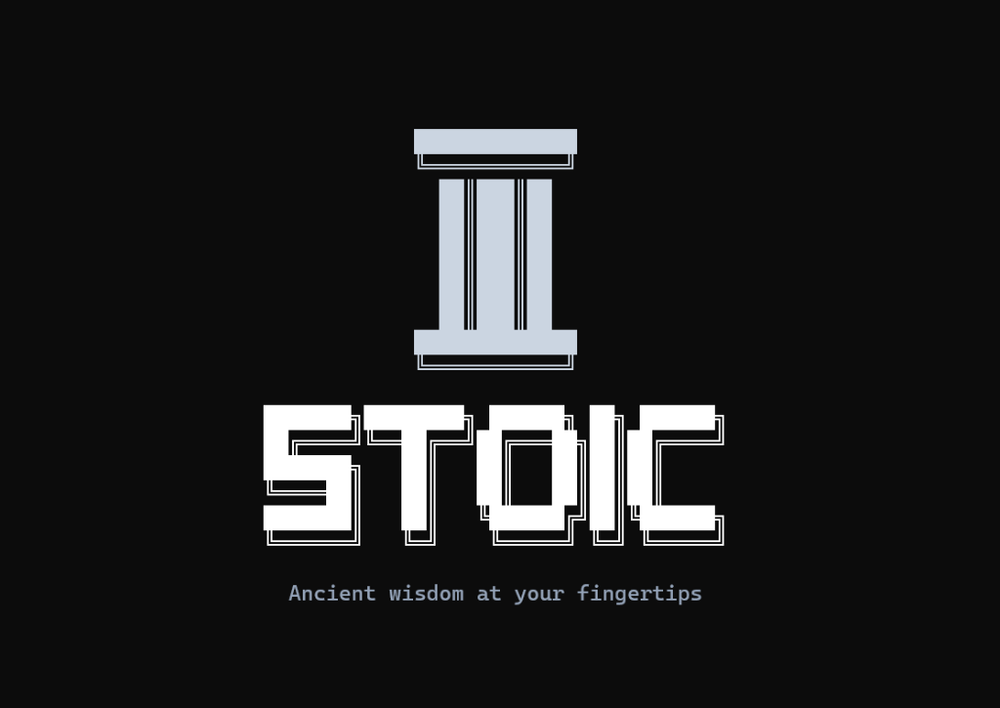
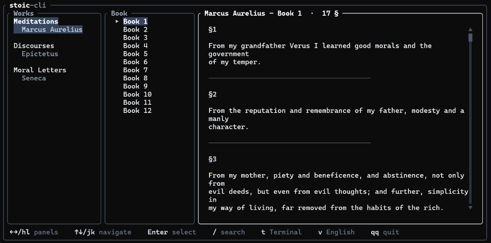

<p align="center">
  
</p>

<p align="center">
  A beautiful Stoic philosophy TUI — read Marcus Aurelius, Seneca & Epictetus in your terminal.
</p>

<p align="center">
  
</p>

---
## Install

```bash
npm install -g stoic-cli
```

Or via shell script:
```bash
curl -fsSL https://raw.githubusercontent.com/Dizro/stoic-cli/main/install.sh | sh
```

## Usage

### Interactive TUI
```bash
stoic
```

### Read a specific passage
```bash
stoic read meditations 4:3
```

### Read a full book/letter
```bash
stoic read seneca 13
```

### Read a range of sections
```bash
stoic read discourses 1:2-5
```

### Search all stoic texts
```bash
stoic search "virtue"
```

### Random stoic passage
```bash
stoic random
```

### Daily stoic passage
```bash
stoic daily
```

### Replay intro animation
```bash
stoic intro
```

When you run `stoic` with no arguments, it launches a full-screen terminal browser:

- **Three-panel layout:** Works → Books/Letters → Text
- **Six languages:** English, Русский, Français, Deutsch, Latina, Ἑλληνικά
- **Five themes:** Obsidian, Marble, Parchment, Bronze, Terminal
- **Keyboard-driven:** Navigate with arrows/hjkl, search with `/`
- **Fully offline:** All texts bundled in the binary

## Keybindings

| Key | Action |
|-----|--------|
| `←→` / `hl` | Switch panels |
| `↑↓` / `jk` | Navigate items |
| `Enter` | Select / Open |
| `/` | Search |
| `t` | Cycle theme |
| `v` | Cycle language |
| `qq` | Quit |

## Supported Texts

| Work | Author | Original | Available Translations |
|------|--------|----------|------------------------|
| Meditations | Marcus Aurelius | Greek | EN, RU, FR, DE, EL |
| Discourses | Epictetus | Greek | EN, RU, FR, DE, EL |
| Moral Letters | Seneca | Latin | EN, RU, FR, DE, LA |

## License

MIT
